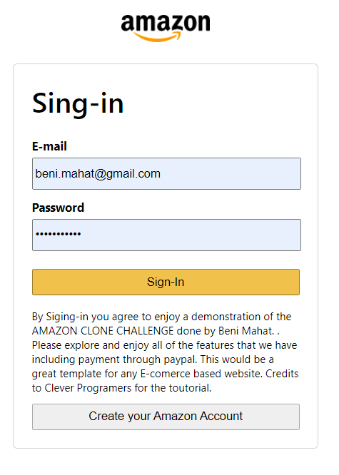
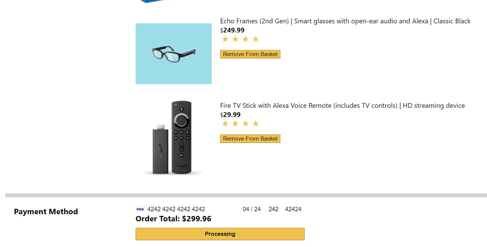

## Table of Contents

* [Description](#description)
* [Links](#links)
* [Screenshots](#screenshots)
* [Installation](#installation)
* [Usage](#usage)
* [Technologies Used](#technologies)
* [Collaborators](#collaborators)
* [Contributing](#contributing)
* [Questions](#questions)

## Description

Designed to Look and function like amazon. Sign up and add items to your basket, when you are ready to purchase checkout your items and pay using your credit card

This application uses firebase clould fucntions to host the Back-end and React.js for the front-end framework. 

## Links

[See the Deployed Amazon Clone on Firebase](https://clone-bc3dc.web.app/)

## Screenshots

Landing page:

Login page:

Basket:

Checkout:

payment:

## Installation Instructions

run "npm i" in the root file of the application. 
run "npm start" to start development server on your localhost

## Usage

This application is intended to demonstrate the functionalty and looks of an e-comerse website designed to look like amazon. This is not made for any comecial use. 

Upon landing on the page you are presented with a simple amazon like homescreen where you can add items to your basket. Before you can checkout out make sure to loggin by signing up for an account. Once you are logged it continue to add more items or go to the checkout page to make to review your order. Once you satisfied you can proceed to checkout where you can use your use your credit card to process the payment. Make sure to not use a real card. Alternatively you can type "424242..." repetivitly for all the card field to test the functionality with this test-card information (as shown in the above screenshot). You can go to your orders page to review your history of purchaces. 

## Technologies Used

Firebase for authentication and cloud fucntion hosting,
 Express.js, Node.js,
 React.js Framework

## Collaborators

This app was built by Beni Mahat.

## Contributing

Thank your to Clever Programmers for providing the resources to implement this build. 

We believe code is never finished, welcome your contributions to enhance the applications functionality. Please adhere to the Code of Conduct for the Contributer Covenant, version 2.0, at https://www.contributor-covenant.org/version/2/0/code_of_conduct.html.

## Questions

If you have further projects and questions, you can find me on Github: [GITHUB](https://github.com/benimahat1291). 
please visit my portfolio to find contact information: [BENI MAHAT](https://benimahat1291.github.io/Portfolio_v2/#/). 